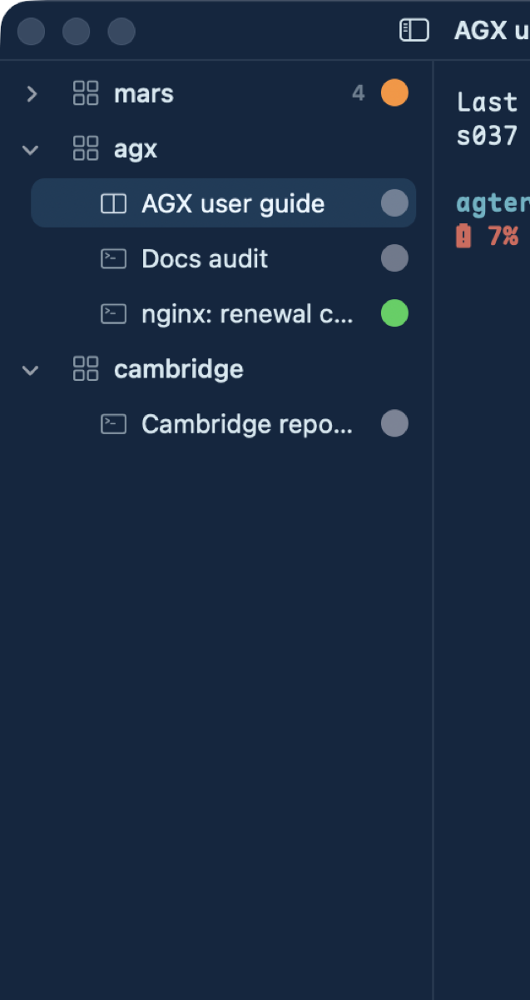
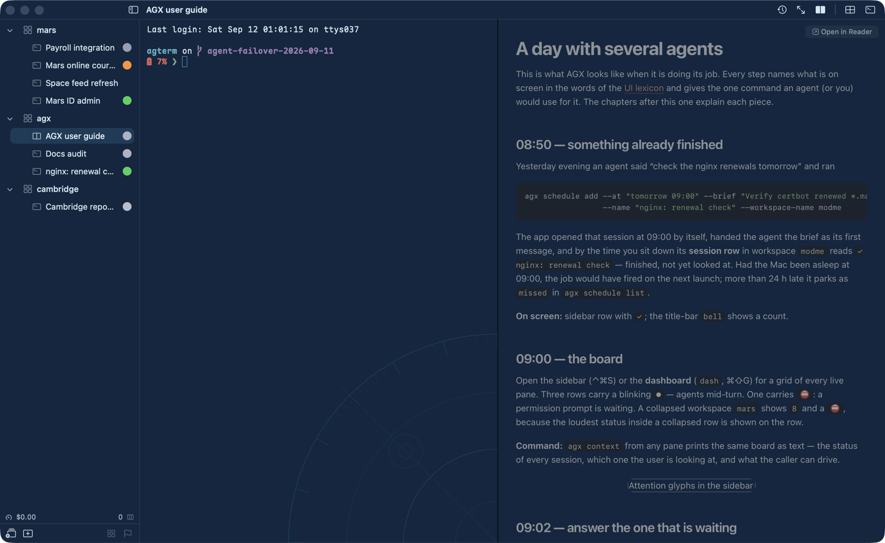

# A day with several agents

This is what AGX looks like when it is doing its job. Every step names what is on screen in the
words of the [UI lexicon](../ui-lexicon.md) and gives the one command an agent (or you) would use
for it. The chapters after this one explain each piece.

## 08:50 — something already finished

Yesterday evening an agent said "check the nginx renewals tomorrow" and ran

```sh
agx schedule add --at "tomorrow 09:00" --brief "Verify certbot renewed *.marshab.uz; write docs/log/…" \
                 --name "nginx: renewal check" --workspace-name modme
```

The app opened that session at 09:00 by itself, handed the agent the brief as its first message,
and by the time you sit down its **session row** in workspace `modme` reads `✓ nginx: renewal check`
— finished, not yet looked at. Had the Mac been asleep at 09:00, the job would have fired on the
next launch; more than 24 h late it parks as `missed` in `agx schedule list`.

**On screen:** sidebar row with `✓`; the title-bar `bell` shows a count.

## 09:00 — the board

Open the sidebar (⌃⌘S) or the **dashboard** (`dash`, ⌘⇧G) for a grid of every live pane. Three rows
carry a blinking `●` — agents mid-turn. One carries `⛔`: a permission prompt is waiting. A collapsed
workspace `mars` shows `8` and a `⛔`, because the loudest status inside a collapsed row is shown on
the row.

**Command:** `agx context` from any pane prints the same board as text — the status of every
session, which one the user is looking at, and what the caller can drive.



## 09:02 — answer the one that is waiting

⌃⌥↓ steps through every session with a glyph, `⛔` first, then `●`, then `✓`. The agent is asking whether it may run
a migration; you type `y`. Your keystroke clears the glyph — a glyph means *unacknowledged*, and
touching the pane is the acknowledgement.

**Command:** `agtermctl session type --target <id> --select "y\n"` does the same from a script;
`\n` submits.

## 09:20 — an agent delegated on its own

The `agx` workspace has grown a row you did not open: `● ◐ Docs audit`. The agent in the row above it
decided the audit was separable and ran

```sh
agx spawn --brief "Audit docs/ for stale paths; write docs/audit.md as you go" \
          --name "Docs audit" --cwd ~/agterm
```

The new pane is a full Claude Code session, launched with that brief as its first message, in the
caller's workspace and directory. It cannot ask the caller anything back, so the brief had to be a
complete task. Meanwhile the caller wrote its plan to `docs/plans/guide.md` and ran
`agx reader docs/plans/guide.md`: its **split pane** now shows the rendered document beside the
shell, re-rendering on every save.

**On screen:** two rows where there was one; the first has `split` lit in the title bar and a
document in its right pane.



## 11:40 — one ran out of quota

A Claude pane stops with "You're out of usage credits for Opus". Its `StopFailure` hook reports it;
AGX types `/model sonnet[1m]` into the pane and `continue` — same context, same cache. When the
whole account is spent instead, a new row `Payroll → Codex` appears beside the old one, running
Codex with a brief digested from the transcript (the failure, the last three prompts, the last
answer, the transcript path). A notification names what happened either way.

**Command:** an agent can ask for the handoff itself: `agtermctl session failure rate_limit --handoff`.

## 18:30 — "close the session"

You tell an agent it is done. Its `CLAUDE.md` says what that means here: append the handoff log,
commit its own files, then

```sh
agtermctl session close --target "$AGTERM_SESSION_ID"
```

The row disappears (⌘Z brings it back within 3 s; ⌘⇧T reopens it later, resuming the same Claude
conversation). Closing the *session* is what kills the process — the next step is why that matters.

## 23:00 — quit; 08:50 — everything is still running

⌘Q. Every agent keeps running: each command session sits under a detached
[abduco](https://github.com/martanne/abduco) server named by its session id, and the app is only a
client. In the morning the same windows, workspaces, names, splits, and flags come back, and every
pane reattaches to the same PID — the agent finishes the turn it was in, with its prompt cache warm.
`agtermctl tree --json` reports `"attached": true` on every such session.

**On screen:** identical to last night, minus the overlays, the reader, and the quick terminal,
which are the only things a restart drops.

## The shape of it

| you want | look at | press / run |
|---|---|---|
| who needs me | sidebar glyphs, `bell` | ⌃⌥↑ / ⌃⌥↓, ⌃⇧I |
| everything at once | `dash` | ⌘⇧G |
| any session by name | session palette | ⌃P |
| a side task now | a peer session | `agx spawn --brief …` |
| a side task later | a scheduled session | `agx schedule add --at … --brief …` |
| a document, not a chat paste | the split pane | `agx reader file.md` |
| to go home | nothing — quit | ⌘Q |
